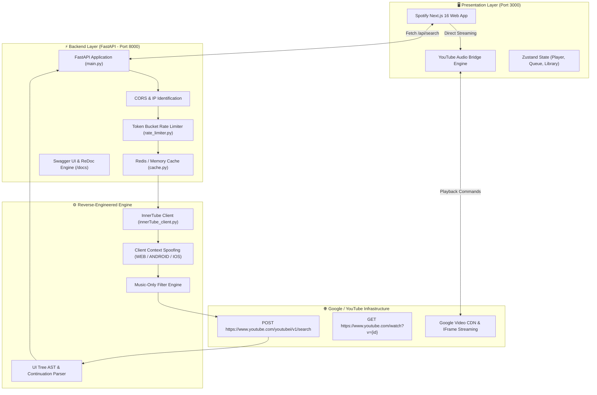

# System Architecture & Technical Specification

## 1. Executive Summary
The **YouTube Music API & Web App** is a full-stack, reverse-engineered music discovery and streaming platform. It provides unlimited music searches, metadata extraction, and streaming playback without requiring third-party API keys (like Google Data API v3) or incurring cloud quota charges.

---

## 2. High-Level System Topology



---

## 3. Core Component Architecture

### A. FastAPI Backend (`backend/`)
- **[main.py](file:///c:/Users/vaibhav%20ghoshi/youtube-music-api/backend/main.py)**:
  - **Lifespan Manager**: Handles async startup and shutdown sequences (connecting Redis, initiating rate limiter background cleanup tasks, spinning up connection pools).
  - **REST Endpoints**: Exposes `/health`, `/api/search`, `/api/video/{video_id}`, `/api/stream/{video_id}`, and `/api/trending`.
  - **OpenAPI / Swagger Generation**: Automatically produces OpenAPI 3.1 specifications and Swagger documentation.
- **[models.py](file:///c:/Users/vaibhav%20ghoshi/youtube-music-api/backend/models.py)**:
  - Strongly typed Pydantic models for data contracts (`VideoInfo`, `AudioStream`, `SearchResult`, `StreamResponse`, `VideoDetailResponse`, `ErrorResponse`).
- **[cache.py](file:///c:/Users/vaibhav%20ghoshi/youtube-music-api/backend/cache.py)**:
  - Multi-tier caching layer: attempts connection to Redis (`REDIS_URL`) and gracefully falls back to an in-memory TTL store if Redis is unavailable.
  - Default TTL: 1800s (30 mins) for search results, 3600s (1 hr) for video details.
- **[rate_limiter.py](file:///c:/Users/vaibhav%20ghoshi/youtube-music-api/backend/rate_limiter.py)**:
  - Token Bucket algorithm with per-IP tracking. Default configuration allows 10 req/s with a burst capacity of 20 tokens. Includes periodic memory cleanup for stale IP buckets.

---

### B. InnerTube Engine (`backend/innerTube_client.py`)
- **Context Spoofing**: Simulates genuine YouTube client headers (`clientName`, `clientVersion`, `userAgent`, `visitorData`).
- **Protobuf Parameter Masking**: Sends music-specific category masks (`EgWKAQIIAWoKEAUQBRDIAQ==`) to ensure searches exclusively return music tracks.
- **Renderer AST Parsing**: Deeply traverses YouTube's UI response tree (`sectionListRenderer` -> `itemSectionRenderer` -> `videoRenderer`) to extract titles, artists, thumbnails, durations, and continuation tokens.
- **Anti-Fingerprinting**: Automatically rotates client signatures (`WEB`, `ANDROID`, `IOS`) every 20 queries and executes exponential backoff with random jitter on HTTP 429 status codes.

---

### C. Spotify Next.js Frontend (`spotify/`)
- **Framework**: Next.js 16 (App Router + Turbopack).
- **State Architecture (Zustand)**:
  - `playerStore.ts`: Global queue, current track, play/pause state, seeking, volume.
  - `libraryStore.ts`: Playlists, liked songs, recent history.
  - `useUIStore.ts`: Modals (Equalizer, Lyrics, Device Connect, Shortcuts), toast notifications.
- **Audio Engine**: Utilizes [YouTubeAudioEngine.tsx](file:///c:/Users/vaibhav%20ghoshi/youtube-music-api/spotify/components/Player/YouTubeAudioEngine.tsx) as an invisible IFrame bridge to ensure 100% playable streaming without server-side signature deciphering bottlenecks.

---

## 4. API Data Flow

```
1. Client Search Action:
   User searches "Coldplay" in UI -> UI dispatches GET to /api/search?q=Coldplay&limit=20

2. Rate Limiting & Cache Check:
   RateLimiter verifies client IP quota -> CacheManager checks key "ytmusic:search:Coldplay:20:start"

3. Outbound InnerTube Dispatch (on Cache Miss):
   InnerTubeClient builds context & sends POST to https://www.youtube.com/youtubei/v1/search
   Payload includes music filter params.

4. AST Parsing & Response Caching:
   InnerTubeClient extracts VideoInfo objects -> Cache stores response for 30 min -> Returns JSON.

5. Playback Trigger:
   User clicks track -> PlayerStore loads videoId into YouTubeAudioEngine -> Track streams.
```

---

## 5. Security, Resilience & Scalability

| Dimension | Strategy Implemented |
|---|---|
| **CORS Policy** | Permissive `*` with standard credential header support |
| **API Quotas** | Local token bucket rate limiter (10 rps / 20 burst) |
| **Failover** | Redis -> In-memory cache fallback |
| **Network Retries** | 3-tier exponential backoff with random jitter |
| **Containerization** | Multi-stage `Dockerfile` and `docker-compose.yml` for unified deployment |
