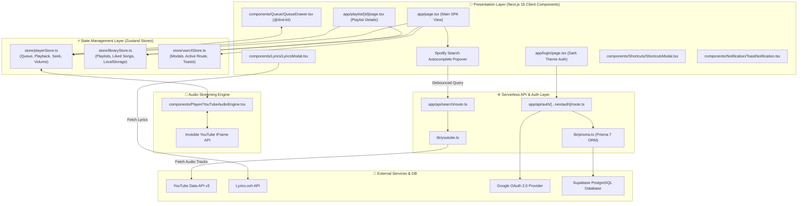

# Spotify Clone - Architecture & Module Technical Specification

This document provides a comprehensive technical breakdown of how the Spotify Clone web application modules are structured, interconnected, and operating.

---

## 1. System Architecture Diagram

---

## 2. Module Specifications & Interconnections

### 1. Presentation & UI Layer (`app/page.tsx`, `app/playlist/[id]/page.tsx`)
- **Main SPA Container (`app/page.tsx`)**:
  - Implements the exact 3-panel Spotify desktop layout (Left Library Sidebar, Sticky Top Navigation Bar, Main Content Area, and Fixed Bottom Player Bar).
  - Handles page view switching (`home`, `search`, `library`, `playlist`) via local state and `useUIStore`.
  - Displays dynamic greeting (`Good morning / afternoon / evening`), 2×3 Recently Played grid, and Made For You playlist section with high-definition album art cover posters (`scale-[1.35]` letterbox cropping).

- **Spotify Autocomplete Popover Dropdown**:
  - Integrated into the top search bar pill container.
  - When typing a query, it renders instant query suggestions (`🔍 barsaat x spiderman`, `🔍 barsaat song`) and live track search results with cover art, `Song • Artist` subtitles, play button hover overlays, and `⊕ Add to Queue` controls.

---

### 2. State Management Layer (Zustand Stores)
- **`store/playerStore.ts`**:
  - Manages active playback state (`currentTrack`, `isPlaying`, `progress`, `duration`, `volume`, `repeatMode`, `shuffleMode`).
  - Manages playback history and dynamic track queue (`queue`, `history`, `play()`, `next()`, `previous()`, `seek()`).
  - Supports backward-compatible state getters for seamless component consumption.

- **`store/libraryStore.ts`**:
  - Manages user playlists (`playlists`), liked tracks (`likedSongs`), and recently played tracks (`recentlyPlayed`).
  - Implements client-side persistence with `localStorage` (`sp_playlists`, `sp_liked`, `sp_recent`).
  - Provides CRUD operations: `createPlaylist()`, `deletePlaylist()`, `addToPlaylist()`, `toggleLike()`, and `@dnd-kit` queue reordering.

- **`store/useUIStore.ts`**:
  - Centralized store for UI overlays: drawer visibility (`isQueueOpen`), modal states (`isLyricsOpen`, `isShortcutsOpen`, `isCreatePlaylistModalOpen`), active SPA route, and toast notification dispatching (`addToast()`).

---

### 3. Audio Streaming Engine (`YouTubeAudioEngine.tsx` + `lib/youtube.ts`)
- **YouTube IFrame API Bridge (`components/Player/YouTubeAudioEngine.tsx`)**:
  - Invisible 0×0 pixel iframe component mounted globally.
  - Synchronizes with `playerStore` ticks for play/pause, volume control, progress polling (every 1000ms), and manual timeline seeking (`playerRef.current.seekTo(time, true)`).
  - Listens for track completion (`onStateChange === 0`) to advance the queue automatically.
  - Features Error `150/101` restriction handling: auto-skips owner-restricted videos and dispatches user toast alerts.

- **YouTube API & Audio Filtering (`lib/youtube.ts`)**:
  - Interfaces with YouTube Data API v3 (`/search`).
  - Automatically appends `" audio"` to search queries to prioritize embeddable audio track uploads over restricted official VEVO video clips.
  - Decodes HTML entities (`&quot;`, `&#39;`) and strips metadata tags for clean Spotify-style display.
  - Provides robust offline fallback tracks with real cover posters if `YOUTUBE_API_KEY` is absent or rate-limited.

---

### 4. Full-Stack Authentication & Database Layer (`NextAuth.js` + `Prisma 7`)
- **NextAuth.js (`lib/auth.ts`, `app/api/auth/[...nextauth]`)**:
  - Implements Google OAuth provider with session persistence across page reloads.
  - Enforces route protection on authenticated paths and API routes.

- **Prisma 7 ORM (`prisma/schema.prisma`, `lib/prisma.ts`)**:
  - Connected to Supabase PostgreSQL database.
  - Models: `User`, `Account`, `Session`, `Playlist`, `PlaylistTrack`, `LikedSong`, `UserPreference`.

---

### 5. Interactive Utility Suite
- **Queue Drawer (`components/Queue/QueueDrawer.tsx`)**:
  - Slide-over drawer with `@dnd-kit` drag-and-drop reordering for upcoming queued tracks.
- **Lyrics Modal (`components/Lyrics/LyricsModal.tsx`)**:
  - Synchronized/unsynchronized lyrics viewer fetching live song lyrics from `api.lyrics.ovh`.
- **Keyboard Shortcuts (`components/Shortcuts/ShortcutsModal.tsx`)**:
  - Global hotkeys cheat sheet (`Space` for play/pause, `?` for shortcuts modal, `Ctrl+Shift+L` for search).
- **Toast Notifications (`components/Notification/ToastNotification.tsx`)**:
  - Non-intrusive alert system for queue updates, playlist additions, and playback warnings.

---

## 3. Step-by-Step Data Flow Example: Searching & Playing a Track

1. **User Types Search Query**: User types `"barsaat"` in the top bar.
2. **Debounced Search Dispatch**: `app/page.tsx` sends a GET request to `/api/search?q=barsaat`.
3. **YouTube API Search**: `/api/search` executes `searchYouTubeTracks("barsaat audio")` against YouTube Data API v3.
4. **Results Popover Rendering**: Search results populate the **Autocomplete Popover Dropdown** with album posters.
5. **Track Playback Trigger**: User clicks a track in the popover. `play(track)` is invoked on `playerStore`.
6. **Audio Streaming Sync**: `YouTubeAudioEngine` receives updated `currentTrack`, loads the YouTube video ID into the IFrame player, and begins background audio playback while progress polls to `playerStore`.
